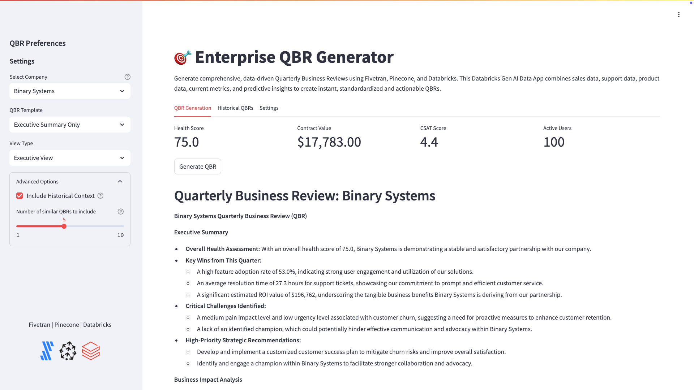

# Enterprise QBR Generator

The Enterprise QBR Generator transforms the traditional QBR process by automating the generation of standardized, data-driven business reviews using Fivetran, Pinecone and Databricks. The app addresses two critical challenges in sales organizations: 

1. Creating consistent, reliable QBR presentations for management 
2. Eliminating the time-intensive QBR preparation process for account executives 

The app combines sales data, support data, product data, current metrics, and predictive insights to create instant, standardardized and actionable QBRs through an intuitive interface. Users can customize outputs through multiple templates (Sales, Executive, Technical, Customer Success) while maintaining standardization across the organization. 

It also leverages vector similarity search for contextual relevance and provides predictable outputs covering executive summaries, business impact, product adoption, and strategic recommendations - all without requiring manual effort or presentation creation from the sales team or management team.



## Features

### Overview
- **Automated QBR Generation**: Transform raw business data into comprehensive QBR presentations with one click
- **Multiple View Types**: 
  - Sales View
  - Executive View
  - Technical View
  - Customer Success View
- **Customizable Templates**:
  - Standard QBR
  - Executive Summary Only
  - Technical Deep Dive
  - Customer Success Focus
- **Interactive Metrics Dashboard**:
  - Health Score
  - Contract Value
  - CSAT Score
  - Active Users
- **Advanced RAG Implementation**: 
  - Pinecone vector search for semantic matching
  - Context-aware LLM responses
  - Historical QBR context inclusion
  - Metadata-enriched search results

### Interactive Data App
* Modern, intuitive Streamlit interface with tabs navigation
* Dynamic company selection dropdown with auto-complete
* Multiple QBR templates and view types
* Real-time metrics display
* Historical QBR viewing capability
* Download functionality for generated QBRs

### Core Metrics Dashboard
* Real-time display of key performance indicators:
  - Health Score calculation
  - Contract Value tracking
  - CSAT Score monitoring
  - Active Users count
* Visual representations using Streamlit metrics components

### Template Customization
* Multiple QBR templates:
  - Standard QBR
  - Executive Summary Only
  - Technical Deep Dive
  - Customer Success Focus
* View type selection:
  - Sales View
  - Executive View
  - Technical View
  - Customer Success View
* Advanced options for customization:
  - Historical context inclusion
  - Context depth control
  - Template preferences

## Vector Search Implementation

### Embedding Generation
* Uses sentence-transformers/all-MiniLM-L6-v2 model
* Processes QBR data into unified text representations
* Handles multiple data types and formats
* Batch processing with error handling
* Automatic retry logic for failed operations

### Pinecone Integration
* Serverless vector database configuration
* Cosine similarity search for relevant QBRs
* Configurable search parameters:
  - Number of similar QBRs (top_k)
  - Similarity threshold settings
  - Context window size
* Metadata-enriched vector storage
* Comprehensive verification system

## LLM Integration

### Databricks Model Serving
* Direct integration with Llama-3 405B model
* System prompt optimized for business analysis
* Support for multiple hosted model options:
  - Mixtral 8x7B
  - DBRX
  - Llama-3 70B
  - Llama-3 405B (default)
  - Note: Databricks also supports bringing your own model (Open AI, Claude, etc.)
* Request timeout set to 90 seconds
* Token usage tracking and metrics

### Prompt Engineering
* Context-aware prompt construction
* Template-specific prompt optimization
* Dynamic prompt adjustment based on view type
* Historical context integration
* Metadata utilization for enhanced responses

## RAG Implementation

### Context Management
* Retrieval Augmented Generation using Pinecone
* Configurable number of similar QBRs (default: 5)
* Intelligent context merging
* Weighted relevance scoring
* Source tracking for used information

### Response Generation
* Structured QBR sections:
  1. Executive Summary
  2. Business Impact Analysis
  3. Product Adoption Review
  4. Support and Success Analysis
  5. Strategic Recommendations
  6. Action Items
* Token usage tracking
* Response formatting in markdown
* Download options for generated content

## Query Types

### Standard QBR Generation
* Comprehensive business review creation
* Data-driven insights and analysis
* Key metrics highlight
* Strategic recommendations
* Action item generation

### Executive Summary Focus
* High-level overview generation
* Key performance indicators
* Strategic insights
* Risk assessment
* Opportunity identification

### Technical Deep Dive
* Detailed product usage analysis
* Feature adoption metrics
* Technical integration status
* Performance metrics
* Infrastructure considerations

### Customer Success View
* Support metrics analysis
* Customer satisfaction tracking
* Usage pattern analysis
* Success metrics evaluation
* Engagement scoring

## Architecture

The application integrates several key components:

### Databricks Data Intelligence Platform
- App hosting through Databricks Apps (Streamlit)
- SQL warehouse for data queries
- Model serving endpoints (Llama-3 405B used for this app)
- Unity Catalog integration

### Fivetran Data Movement Platform
- Automated data ingestion
- Delta Lake table management
- Schema evolution handling

### Pinecone Vector Store
- Semantic search capabilities
- Pre-computed embeddings using sentence-transformers/all-MiniLM-L6-v2
- Metadata-enriched vectors

### Streamlit Frontend (Databricks App)
- Responsive web interface
- Session state management
- Dynamic rendering
- Multiple view templates


## Prerequisites

### Required Accounts & Resources
- **Databricks Workspace** with:
  - SQL Warehouse
  - Model Serving Endpoint (Llama-3 405B)
  - Unity Catalog
  - Databricks Apps
- **Fivetran Account** with:
  - Databricks or MDLS destination configured
- **Pinecone Account** with:
  - API key
  - Serverless index capability

### Python Requirements
```
altair==5.5.0
databricks-sdk==0.43.0
databricks-sql-connector==4.0.0
pinecone-client==3.0.1
streamlit==1.42.0
torch==2.6.0
transformers==4.48.3
sentence-transformers==2.2.2
```

## Implementation Steps

### 1. Repository Setup
1. Create a new repository using GitHub Desktop
2. Import base files from template repository
3. Configure local development environment (e.g. VS Code)

## Directory Structure
```
DATABRICKS-APPS-SL-QBR-GENERATOR/
├── .databricks/                    # Databricks sync snapshots
├── .vscode/                        # VS Code settings
├── images/                         # Screenshot references
├── venv/                           # Virtual environment
├── .gitattributes                  # Git attributes configuration
├── .gitignore                      # Files to exclude from Git
├── app.py                          # Main application code
├── app.yaml                        # Databricks app configuration
├── app.yaml.template               # Template for app configuration
├── config.json                     # Application configuration
├── config.json.template            # Template for app configuration
├── README.md                       # Documentation
├── requirements.txt                # Python dependencies
├── test_connection.py              # Connection testing utility
├── token.txt                       # Development tokens (not for production)
├── update_resources.json           # Resource configuration
└── update_resources.json.template  # Template for resource configuration
```

## Configuration Files

The application uses three main configuration files. For security, template versions are provided and actual configuration files should never be committed to the repository.

### .gitignore Setup
```gitignore
# Ignore sensitive configuration files
config.json
update_resources.json
secret*.json

# Keep templates
!config.json.template
!app.yaml.template
!update_resources.json.template

# Python and IDE specific ignores
venv/
__pycache__/
.vscode/
.databricks/
```

### app.yaml.template
```yaml
command: ["streamlit", "run", "app.py", "--server.port", "8000", "--server.address", "0.0.0.0"]

env:
  - name: DATABRICKS_SQL_HTTP_PATH
    value: '/sql/1.0/warehouses/<your-warehouse-id>'
  - name: DATABRICKS_SERVING_ENDPOINT_URL
    value: 'https://<your-workspace-url>/serving-endpoints/<your-endpoint-name>/invocations'
  - name: DATABRICKS_TOKEN
    valueFrom: secret
  - name: DATABRICKS_HOST
    value: 'https://<your-workspace-url>'
  - name: UC_CATALOG
    value: '<your-catalog>'
  - name: UC_SCHEMA
    value: '<your-schema>'
  - name: UC_TABLE
    value: '<your-table>'
  - name: PINECONE_API_KEY
    valueFrom: secret-2
  - name: PINECONE_INDEX_NAME
    value: 'qbr-embeddings'
  - name: PINECONE_HOST
    value: 'https://<your-pinecone-index>.svc.<your-environment>.pinecone.io'

resources:
  secret:
    - name: 'databricks-app-secrets'
      key: secret
    - name: 'pinecone-secrets'
      key: secret-2
```

### config.json.template
```json
{
    "api_keys": {
        "pinecone_api_key": "<your-pinecone-api-key>"
    },
    "pinecone": {
        "index_name": "qbr-embeddings",
        "environment": "<your-pinecone-environment>",
        "host": "https://<your-index-name>-<your-project-id>.svc.<your-environment>.pinecone.io",
        "dimension": 384,
        "metric": "cosine",
        "cloud": "aws",
        "region": "us-east-1",
        "capacity_mode": "serverless"
    },
    "models": {
        "embedding_model": "sentence-transformers/all-MiniLM-L6-v2"
    }
}
```

### update_resources.json.template
```json
{
    "name": "<your-app-name>",
    "resources": {
      "sql-warehouse": "<your-sql-warehouse-name>",
      "model-serving": "<your-model-serving-endpoint>"
    }
}
```

### Configuration Setup Steps

1. Create your configuration files from templates:
```bash
cp app.yaml.template app.yaml
cp config.json.template config.json
cp update_resources.json.template update_resources.json
```

2. Update app.yaml:
- Replace `<your-warehouse-id>` with SQL warehouse ID
- Update workspace URL and endpoint details
- Configure Unity Catalog values
- Set Pinecone connection details

3. Update config.json:
- Add your Pinecone API key
- Configure Pinecone environment settings
- Verify region and cloud settings

4. Update update_resources.json:
- Set your Databricks app name
- Configure warehouse and model serving endpoints

5. Verify Configuration:
```bash
# Test Databricks connection
python test_connection.py

# Verify Pinecone setup
python -c "from pinecone import Pinecone; pc = Pinecone(api_key='your_key'); print(pc.list_indexes())"
```

### 2. Data Pipeline Setup

#### Fivetran Configuration
1. Create a new Fivetran connector:
   - Source: Add connectors for each source system
     - SFDC, Hubspot, Dynamix 365 connector (sales data)
     - Zendesk connector (support data)
     - Jira connector (product data)
   - Destination: Databricks or MDLS
   - **Note**: A synthetic dataset representing the combination of these sources was created and is part of the industry database in PostgreSQL (industry > sales > qbr_data)
2. Connector details:
   - Target location: 
     - Catalog: ts-catalog-demo (Destination config)
     - Schema: accelerate_qbrs_sales (connector name)
     - Table: qbr_data (table in the industry database and sales schema)
3. Set up incremental sync schedule


#### Source Systems Integration
The QBR Generator is built from multiple enterprise systems through Fivetran connectors:

1. **CRM Systems** (SFDC, Hubspot, Dynamics 365)
   - Company core information
   - Deal and financial data
   - MEDDICC framework data
2. **Support System** (Zendesk)
   - Ticket metrics
   - Customer satisfaction data
3. **Product Analytics** (Jira)
   - Usage statistics
   - Feature adoption metrics

#### Target Configuration
- Catalog: ts-catalog-demo
- Schema: accelerate_qbrs_sales
- Table: qbr_data

#### Data Sources & Fields

##### Company Information (SFDC, Hubspot, Dynamics 365)
| Field | Description | Format/Values |
|-------|-------------|---------------|
| company_id | Primary Key | Format: 'COMPxxxx' |
| company_name | Business Name | Industry-specific naming |
| industry | Business Sector | Technology, Healthcare, Finance, Manufacturing, Retail |
| size | Company Size | Small, Medium, Enterprise |
| contract_value | Contract Amount | Numeric |
| contract_start_date | Start Date | Date |
| contract_expiration_date | End Date | Date |

##### Deal/Financial Data (SFDC, Hubspot, Dynamics 365)
| Field | Description | Values |
|-------|-------------|---------|
| deal_stage | Current Stage | Implementation, Live, At Risk, Stable |
| renewal_probability | Renewal Likelihood | Percentage |
| upsell_opportunity | Potential Additional Value | Numeric |
| qbr_quarter | Fiscal Quarter | Based on Feb 1 - Jan 31 Fiscal Year |
| qbr_year | Fiscal Year | Year |

##### Product Usage Data (Jira)
| Field | Description | Format |
|-------|-------------|--------|
| active_users | Current Users | Integer |
| feature_adoption_rate | Usage Rate | Percentage |
| custom_integrations | Custom Setup Count | Integer |
| pending_feature_requests | Open Requests | Integer |

##### Support Data (Zendesk)
| Field | Description | Format |
|-------|-------------|--------|
| ticket_volume | Support Tickets | Integer |
| avg_resolution_time_hours | Resolution Time | Hours |
| csat_score | Satisfaction Score | 1-5 Scale |
| sla_compliance_rate | SLA Adherence | Percentage |

##### MEDDICC Fields

###### Metrics
| Field | Description | Format |
|-------|-------------|--------|
| success_metrics_defined | Defined Success Metrics | Boolean |
| roi_calculated | ROI Analysis Done | Boolean |
| estimated_roi_value | Expected Return | Numeric |

###### Economic Buyer
| Field | Description | Values |
|-------|-------------|---------|
| economic_buyer_identified | Buyer Known | Boolean |
| executive_sponsor_engaged | Exec Engagement | Boolean |
| decision_maker_level | Authority Level | C-Level, VP, Director, Manager |

###### Decision Process
| Field | Description | Format |
|-------|-------------|--------|
| decision_process_documented | Process Documented | Boolean |
| next_steps_defined | Clear Next Steps | Boolean |
| decision_timeline_clear | Timeline Established | Boolean |

###### Decision Criteria
| Field | Description | Format |
|-------|-------------|--------|
| technical_criteria_met | Tech Requirements Met | Boolean |
| business_criteria_met | Business Requirements Met | Boolean |
| success_criteria_defined | Success Definition | Text |

###### Identified Pain
| Field | Description | Values |
|-------|-------------|---------|
| pain_points_documented | Issues Documented | Text |
| pain_impact_level | Impact Severity | High, Medium, Low |
| urgency_level | Time Sensitivity | High, Medium, Low |

###### Champion
| Field | Description | Values |
|-------|-------------|---------|
| champion_identified | Champion Known | Boolean |
| champion_level | Champion Authority | C-Level, VP, Director, Manager |
| champion_engagement_score | Engagement Rating | 1-5 Scale |

###### Competition
| Field | Description | Values |
|-------|-------------|---------|
| competitive_situation | Competitor Presence | Single, Multiple, None |
| competitive_position | Market Position | Leader, Strong, Weak |

###### Calculated Metrics
| Field | Description | Format |
|-------|-------------|--------|
| health_score | Overall Health | Weighted calculation based on key metrics |

#### Control Records
The dataset includes 5 control records for RAG testing and validation:
1. Kohlleffel Inc
2. Hrncir Inc
3. Millman Inc
4. Tony Kelly Inc
5. Kai Lee Inc

Control record specifications:
- Industry: Technology
- Size: Small
- Contract expiration: 2025-01-31
- QBR period: Q4 2024
- Other fields: Randomly generated within valid ranges

### 3. Data Transformation and Vector Embedding Creation (Databricks Notebook Implementation)

Each cell in the implementation notebook serves a specific purpose in transforming the raw data and creating vector embeddings. Here's a detailed breakdown of each cell:

#### Cell 1: Initialize Unity Catalog Variables
Sets up database context and defines source/target tables.
```python
# Step 1: Set Unity Catalog database and table variables
catalog_name = "ts-catalog-demo"
schema_name = "accelerate_qbrs_sales"
source_table = f"{catalog_name}.{schema_name}.qbr_data"
target_table = f"{catalog_name}.{schema_name}.qbr_data_single_string"

# Set the database context
spark.sql(f"USE CATALOG `{catalog_name}`")
spark.sql(f"USE {schema_name}")
```
Expected Output:
```
DataFrame[]  # Success - no errors
```

#### Cell 2: Transform QBR Data
Creates unified text representation and metadata for vector search.
```sql
%sql
-- Step 2: Create each QBR review as a single field vs multiple fields and create a metadata column to be used for Pinecone embeddings
CREATE OR REPLACE TABLE qbr_data_single_string AS 
SELECT 
    company_name, 
    company_id, -- Explicitly include company_id
    CONCAT(
        'The company name is ', IFNULL(company_name, 'unknown'), '.',
        ' The company ID is ', IFNULL(company_id, 'unknown'), '.',
        ' This is a ', IFNULL(size, 'unknown'), ' ', IFNULL(industry, 'unknown'), ' company.',
        ' The contract started on ', IFNULL(contract_start_date, 'unknown'), ' and expires on ', IFNULL(contract_expiration_date, 'unknown'), '.',
        ' The annual contract value is $', IFNULL(contract_value, 'unknown'), '.',
        ' The current deal stage is ', IFNULL(deal_stage, 'unknown'), '.',
        ' The renewal probability is ', IFNULL(renewal_probability, 'unknown'), '%.',
        ' The identified upsell opportunity is $', IFNULL(upsell_opportunity, 'unknown'), '.',
        ' The number of active users is ', IFNULL(active_users, 'unknown'), '.',
        ' The feature adoption rate is ', IFNULL(ROUND(feature_adoption_rate * 100, 1), 'unknown'), '%.',
        ' The number of custom integrations is ', IFNULL(custom_integrations, 'unknown'), '.',
        ' The number of pending feature requests is ', IFNULL(pending_feature_requests, 'unknown'), '.',
        ' The number of support tickets is ', IFNULL(ticket_volume, 'unknown'), '.',
        ' The average resolution time is ', IFNULL(avg_resolution_time_hours, 'unknown'), ' hours.',
        ' The CSAT score is ', IFNULL(csat_score, 'unknown'), ' out of 5.',
        ' The SLA compliance rate is ', IFNULL(ROUND(sla_compliance_rate * 100, 1), 'unknown'), '%.',
        ' Success metrics defined: ', IFNULL(success_metrics_defined, 'unknown'), '.',
        ' ROI calculated: ', IFNULL(roi_calculated, 'unknown'), '.',
        ' Estimated ROI value: $', IFNULL(estimated_roi_value, 'unknown'), '.',
        ' Economic buyer identified: ', IFNULL(economic_buyer_identified, 'unknown'), '.',
        ' Executive sponsor engaged: ', IFNULL(executive_sponsor_engaged, 'unknown'), '.',
        ' The decision maker level is ', IFNULL(decision_maker_level, 'unknown'), '.',
        ' Decision process documented: ', IFNULL(decision_process_documented, 'unknown'), '.',
        ' Next steps defined: ', IFNULL(next_steps_defined, 'unknown'), '.',
        ' Decision timeline clear: ', IFNULL(decision_timeline_clear, 'unknown'), '.',
        ' Technical criteria met: ', IFNULL(technical_criteria_met, 'unknown'), '.',
        ' Business criteria met: ', IFNULL(business_criteria_met, 'unknown'), '.',
        ' The success criteria is defined as ', IFNULL(success_criteria_defined, 'unknown'), '.',
        ' The documented pain points are ', IFNULL(pain_points_documented, 'unknown'), '.',
        ' The pain impact level is ', IFNULL(pain_impact_level, 'unknown'), '.',
        ' The urgency level is ', IFNULL(urgency_level, 'unknown'), '.',
        ' Champion identified: ', IFNULL(champion_identified, 'unknown'), '.',
        ' The champion level is ', IFNULL(champion_level, 'unknown'), '.',
        ' The champion engagement score is ', IFNULL(champion_engagement_score, 'unknown'), ' out of 5.',
        ' The competitive situation is ', IFNULL(competitive_situation, 'unknown'), '.',
        ' Our competitive position is ', IFNULL(competitive_position, 'unknown'), '.',
        ' The overall health score is ', IFNULL(health_score, 'unknown'), '.',
        ' This QBR covers ', IFNULL(qbr_quarter, 'unknown'), ' ', IFNULL(qbr_year, 'unknown'), '.'
    ) AS qbr_information,
    CONCAT(
        '{"qbr_info": "', 
        REPLACE(CONCAT(
            'The company name is ', IFNULL(company_name, 'unknown'), '.',
            ' The company ID is ', IFNULL(company_id, 'unknown'), '.',
            ' This is a ', IFNULL(size, 'unknown'), ' ', IFNULL(industry, 'unknown'), ' company.',
            ' The contract started on ', IFNULL(contract_start_date, 'unknown'), ' and expires on ', IFNULL(contract_expiration_date, 'unknown'), '.',
            ' The annual contract value is $', IFNULL(contract_value, 'unknown'), '.',
            ' The current deal stage is ', IFNULL(deal_stage, 'unknown'), '.',
            ' The renewal probability is ', IFNULL(renewal_probability, 'unknown'), '%.',
            ' The identified upsell opportunity is $', IFNULL(upsell_opportunity, 'unknown'), '.',
            ' The number of active users is ', IFNULL(active_users, 'unknown'), '.',
            ' The feature adoption rate is ', IFNULL(ROUND(feature_adoption_rate * 100, 1), 'unknown'), '%.',
            ' The number of custom integrations is ', IFNULL(custom_integrations, 'unknown'), '.',
            ' The number of pending feature requests is ', IFNULL(pending_feature_requests, 'unknown'), '.',
            ' The number of support tickets is ', IFNULL(ticket_volume, 'unknown'), '.',
            ' The average resolution time is ', IFNULL(avg_resolution_time_hours, 'unknown'), ' hours.',
            ' The CSAT score is ', IFNULL(csat_score, 'unknown'), ' out of 5.',
            ' The SLA compliance rate is ', IFNULL(ROUND(sla_compliance_rate * 100, 1), 'unknown'), '%.',
            ' The overall health score is ', IFNULL(health_score, 'unknown'), '.'
        ), '"', '\"'), 
        '"}'
    ) AS metadata
FROM qbr_data;
```
Expected Output:
```
{'num_affected_rows': X, 'num_inserted_rows': Y}
```

#### Cell 3: Load Configuration
Loads external settings and API keys.
```python
# Step 3 - Run config utils and load config
%run ./config_utils.py
config = load_config()
```
Expected Output:
```
Configuration loaded successfully
```

#### Cell 4: Install Required Packages
Sets up Python environment with necessary libraries.
```python
# Step 4: Install the required libraries
%pip install transformers torch scipy pinecone-client sentence-transformers tqdm
```
Expected Output:
```
Successfully installed required packages
```

#### Cell 5: Import Libraries
Imports all required Python modules.
```python
# Step 5: Import required libraries
from transformers import AutoTokenizer, AutoModel
import torch
import numpy as np
from scipy.spatial.distance import cosine
import pandas as pd
from pyspark.sql import SparkSession
from pyspark.sql.functions import udf
from pyspark.sql.types import ArrayType, FloatType
from pinecone import Pinecone, ServerlessSpec
from sentence_transformers import SentenceTransformer
import json
import re
import time
from time import sleep
```

#### Cell 6: Load Data
Transfers data to Pandas for processing.
```python
# Step 6: Load your data into a Pandas dataframe
print(f"Loading data from catalog: {catalog_name}, schema: {schema_name}")
df = spark.table(f"`{catalog_name}`.`{schema_name}`.`qbr_data_single_string`")

# Convert to Pandas for processing
df_pandas = df.toPandas()
```
Expected Output:
```
Loading data from catalog: ts-catalog-demo, schema: accelerate_qbrs_sales
```

#### Optional Cell: Verification
Verify data.
```python
# Step 6a: Verfification
print(df_pandas.head())  # Should show company_id as a separate column
```
Expected Output:
```
5 rows x 4 columns
```

#### Cell 7: Initialize Pinecone
Sets up vector database connection and index.
```python
# Step 7: Initialize Pinecone client
from pinecone import Pinecone, PineconeApiException, ServerlessSpec

api_key = config["api_keys"]["pinecone_api_key"]
index_name = "qbr-embeddings"  # Change from "wine-embeddings previous index"
pc = Pinecone(api_key=api_key)

# Create a Pinecone index if it doesn't exist
existing_indexes = pc.list_indexes()
if index_name not in existing_indexes:
    try:
        pc.create_index(
            name=index_name,
            dimension=384,
            metric="cosine",
            spec=ServerlessSpec(
                cloud="aws",
                region="us-east-1"
            )
        )
        print(f"Created new index: {index_name}")
    except PineconeApiException as e:
        if e.status == 409:
            print(f"Index '{index_name}' already exists.")
        else:
            raise e
else:
    print(f"Index '{index_name}' already exists.")

# Get index
index = pc.Index(index_name)
```
Expected Output:
```
Index 'qbr-embeddings' already exists.
```

#### Optional Cell: Verification
Verify data.
```python
# Step 7a: Quick verification of the index being used
print(f"Using Pinecone index: {index_name}")  # Should print "qbr_embeddings"
```
Expected Output:
```
qbr_embeddings
```

#### Cell 8: Create and Upload Vectors
Generates embeddings and uploads to Pinecone.
```python
# Step 8: Create embeddings in Pinecone and verify the data
import time  # Ensure time is imported for delays
from tqdm import tqdm  # Import tqdm for batch progress tracking
import numpy as np  # For handling batch retries
from sentence_transformers import SentenceTransformer  # Import the embedding model

# Initialize the embedding model
model_name = "sentence-transformers/all-MiniLM-L6-v2"  # Change if needed
model = SentenceTransformer(model_name)

# Get index
index = pc.Index(index_name)

# Function to get embeddings
def get_embedding(text):
    return model.encode(text)

# Load your QBR data table using existing variables
print(f"Loading data from catalog: {catalog_name}, schema: {schema_name}")
df = spark.table(f"`{catalog_name}`.`{schema_name}`.`qbr_data_single_string`")

# Convert to Pandas for processing
df_pandas = df.toPandas()

# Add verification here
print("\nVerifying data before processing:")
for idx, row in df_pandas.iterrows():
    if row['company_name'] in ['Acme Corp', 'Manufacturing Logic']:
        print(f"\nChecking {row['company_name']}:")
        print(f"Original Metadata: {row['metadata']}")
        print(f"QBR Information: {row['qbr_information'][:200]}...")

# Function to sanitize vector IDs
def sanitize_id(vector_id):
    if not isinstance(vector_id, str):
        vector_id = str(vector_id)
    return re.sub(r'[^a-zA-Z0-9_\-]', '_', vector_id)

# Use `company_id` instead of `company_name` for unique IDs
print("\nPreparing data...")
df_pandas['id'] = df_pandas['company_id'].apply(sanitize_id)
df_pandas['values'] = df_pandas['qbr_information'].apply(lambda x: get_embedding(x).tolist())

def upload_in_batches(df, batch_size=100):
    total_batches = len(df) // batch_size + (1 if len(df) % batch_size else 0)

    for i in tqdm(range(0, len(df), batch_size), total=total_batches, desc="Uploading batches"):
        batch_df = df.iloc[i:i+batch_size]

        # Create list of vectors
        vectors = []
        for _, row in batch_df.iterrows():
            vector = {
                'id': row['id'],  # using `company_id`
                'values': row['values'],  # The actual vector embeddings
                'metadata': {'qbr_info': str(row['qbr_information'])}  # Store metadata for retrieval
            }
            vectors.append(vector)

        try:
            # Upload batch to Pinecone
            response = index.upsert(vectors=vectors)
            print(f"\nBatch {i//batch_size + 1} response: {response}")

            # Add a short delay to avoid hitting Pinecone's rate limits
            time.sleep(2)  # Adjust delay if needed
            
        except Exception as e:
            print(f"Error uploading batch {i//batch_size + 1}: {str(e)}")
            try:
                # Try uploading in smaller chunks
                sub_vectors = np.array_split(vectors, 4)
                for j, sub_batch in enumerate(sub_vectors):
                    sub_response = index.upsert(vectors=list(sub_batch))
                    print(f"Sub-batch {j+1} response: {sub_response}")
                    time.sleep(1)  # Delay between sub-batches
            except Exception as sub_e:
                print(f"Sub-batch error: {str(sub_e)}")
        
        time.sleep(2)  # Additional delay between batches

# Get index
index = pc.Index(index_name)

# Prepare data as before...
print("\nUploading vectors to Pinecone...")
upload_in_batches(df_pandas)

# Thorough final verification
print("\nPerforming thorough final verification:")
test_companies = ['Acme_Corp', 'Manufacturing_Logic']
for company in test_companies:
    print(f"\nVerifying {company}:")
    try:
        # Try multiple times with delay
        for attempt in range(3):
            result = index.fetch(ids=[company])
            if result and 'vectors' in result and company in result['vectors']:
                print(f"Found on attempt {attempt + 1}")
                vector = result['vectors'][company]
                print(f"Metadata present: {bool(vector.get('metadata'))}")
                if vector.get('metadata'):
                    print(f"Metadata preview: {str(vector['metadata']['qbr_info'])[:100]}...")
                break
            else:
                print(f"Not found on attempt {attempt + 1}, retrying...")
                time.sleep(2)
        else:
            print("All verification attempts failed")
    except Exception as e:
        print(f"Error during verification: {str(e)}")
```
Expected Output:
```
Uploading vectors to Pinecone...
Uploading batches:   0%|          | 0/8 [00:00<?, ?it/s]
Batch 1 response: {'upserted_count': 100}
Uploading batches:  12%|█▎        | 1/8 [00:04<00:32,  4.59s/it]
Batch 2 response: {'upserted_count': 100}
Uploading batches:  25%|██▌       | 2/8 [00:08<00:26,  4.39s/it]
Batch 3 response: {'upserted_count': 100}
...
```

#### Optional Cell: Verify Data Counts
Confirms data integrity.
```python
# Step 8a: Verification of data
print(f"Total unique company IDs in dataset: {df_pandas['company_id'].nunique()}")
print(f"Total vectors in Pinecone: {index.describe_index_stats()['total_vector_count']}")
```
Expected Output:
```
Total unique company IDs in dataset: 755
Total vectors in Pinecone: 835
```

#### Optional Cell: Check for Duplicates
Identifies duplicate records.
```python
# Step 8b: Verification of data 2
print("\nChecking for duplicate IDs in the dataset before upload...")
print(df_pandas['id'].value_counts().head(10))  # Show the 10 most common IDs
```
Expected Output:
```
Network_Atlas     12
AI_Solutions      12
Cloud_Nexus       12
...
```

### 4. App Deployment

#### Option A: Local Development with VS Code + Databricks CLI

1. **Setup Databricks CLI**
```bash
# Install Databricks CLI
pip install databricks-cli
```

```bash
# Configure CLI with token
databricks configure --token
# Enter your workspace URL and access token when prompted
```

2. **Set Up Local Environment**
```bash
# Create virtual environment
python -m venv venv
source venv/bin/activate  # Linux/Mac
```

```bash
# Install dependencies
pip install -r requirements.txt
```

3. **Deploy to Databricks**
```bash
# Sync code to workspace
databricks sync --watch . /Workspace/Shared/dbx-apps-sl-qbr-generators-2
```

```bash
# Deploy app
databricks apps deploy simple-travelapp-sl --source-code-path /Workspace/Shared/dbx-apps-sl-qbr-generators-2
```

#### Option B: Direct Deployment through Databricks Apps UI
1. Navigate to Compute > Apps > Create App
2. Select "Custom"
3. Enter app name (e.g., "dbx-apps-sl-qbr-generators-2")
4. Upload provided app.py and app.yaml files
5. Configure Resources (**Edit** button and **"**Advanced settings**"** within the DBX app):
   * Add SQL Warehouse
   * Add Serving Endpoint
   * Add Databricks Secret
   * Add Pinecone Secret
6. Deploy the app

#### Compute > Apps > dbx-apps-sl-qbr-generators-2


#### Compute > Apps > dbx-apps-sl-qbr-generators-2 > edit


#### Compute > Apps > dbx-apps-sl-qbr-generators-2 > Deployment


#### Compute > Apps > dbx-apps-sl-qbr-generators-2 > Deployment Detail


#### Compute > Apps > dbx-apps-sl-qbr-generators-2 > Run the App


## Troubleshooting Tips

### App Deployment Issues

#### Resource Configuration
```
Error: Resource not found
```
- Check app.yaml configuration
- Verify resource names
- Confirm service principal access

#### Environment Variables
```
Error: Configuration value not found
```
- Review config.json settings
- Check secret scope access
- Verify environment variable names

#### App Performance
```
Error: Request timeout
```
- Check SQL warehouse size
- Monitor model endpoint latency
- Optimize vector search parameters

### Common Error Messages and Solutions

#### "InvalidDimensionException"
```
Error: Vector dimension mismatch
```
- Verify embedding model output (should be 384)
- Check vector creation process
- Confirm index configuration

#### "PineconeException"
```
Error: Index does not exist
```
- Check index name
- Verify region setting
- Confirm serverless configuration

#### "AuthenticationError"
```
Error: Invalid API key
```
- Check API key in config
- Verify secret scope
- Confirm key permissions

## App Configuration

### Environment Variables
Configure these in app.yaml:
```yaml
command: ["streamlit", "run", "app.py", "--server.port", "8000", "--server.address", "0.0.0.0"]

env:
  - name: DATABRICKS_SQL_HTTP_PATH
    value: '/sql/1.0/warehouses/<your-warehouse-id>'
  - name: DATABRICKS_SERVING_ENDPOINT_URL
    value: 'https://<your-workspace-url>/serving-endpoints/<your-endpoint-name>/invocations'
  - name: DATABRICKS_TOKEN
    valueFrom: secret
  - name: DATABRICKS_HOST
    value: 'https://<your-workspace-url>'
  - name: UC_CATALOG
    value: '<your-catalog>'
  - name: UC_SCHEMA
    value: '<your-schema>'
  - name: UC_TABLE
    value: '<your-table>'
  - name: PINECONE_API_KEY
    valueFrom: secret-2
  - name: PINECONE_INDEX_NAME
    value: 'your_name-embeddings'
  - name: PINECONE_HOST
    value: 'https://<your-pinecone-index>.svc.<your-environment>.pinecone.io'

resources:
  secret:
    - name: 'databricks-app-secrets'
      key: secret
    - name: 'pinecone-secrets'
      key: secret-2
```

### Resource Configuration
Required resources in Databricks Apps UI:
1. SQL Warehouse
2. Model Serving Endpoint
3. Secret scope for API keys
4. Unity Catalog access

## Streamlit Application Usage

1. Select company from dropdown
2. Choose QBR template type:
   - Standard QBR
   - Executive Summary Only
   - Technical Deep Dive
   - Customer Success Focus
3. Select view type:
   - Sales View
   - Executive View
   - Technical View
   - Customer Success View
5. Generate QBR
6. Download or view historical QBRs

## Streamlit Databricks App Code
- Refer to the **app.py** and **app.yaml** files

## Performance and Response Time Considerations
* The QBR Generation prompts are complex. Expect your QBR to be returned in 30-45 seconds.
* The read timeout in the app.py is set at 90 seconds.

## Contributing

Contributions are welcome! Please follow these steps:

1. Fork the repository
2. Create a feature branch
3. Make your changes
4. Submit a pull request

Please ensure:
- Code follows project style
- Tests are included
- Documentation is updated
- Commit messages are clear